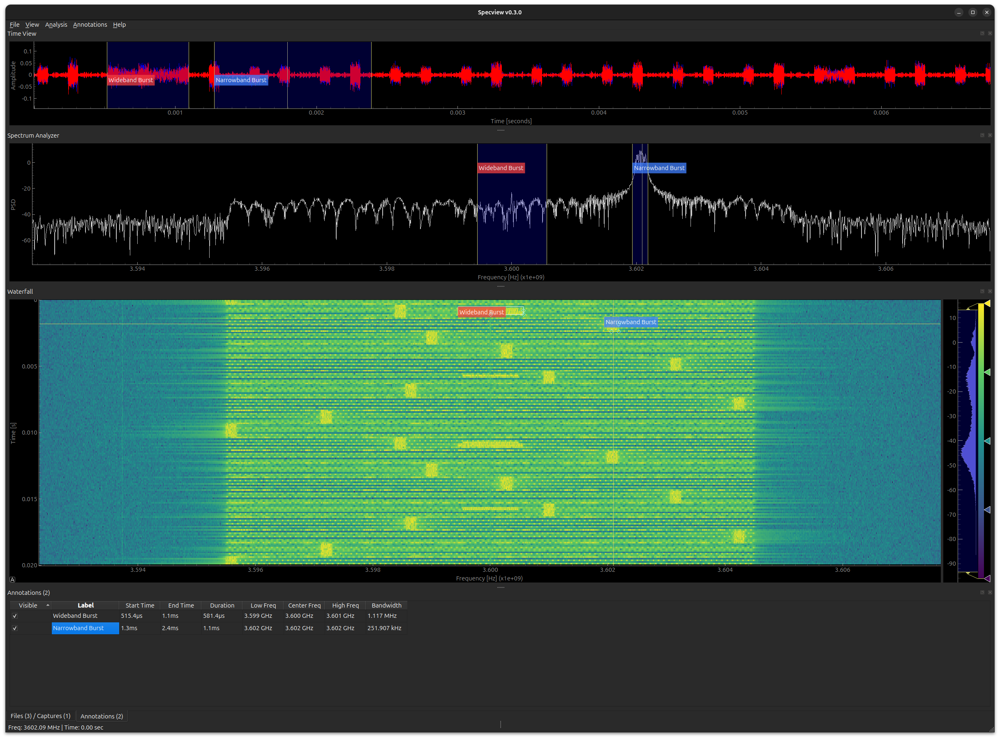

# specview: A SigMF File Viewer and Annotation Editor

The [SigMF](https://sigmf.org/) ("Signal Metadata Format") is a standard format for exchanging digitally-sampled time-series data with JSON-based metadata.  It is often used for storing real or complex-valued (IQ) time series data in digital signal processing or software-defined radio applications.

`specview` is a portable and performant SigMF file viewer and annotation editor.



## Features

- Simultaneous **time-domain, spectrum, and waterfall (spectrogram) views** with linked brushing (simultaneously select time and frequency regions).
- Support for viewing **large files** (10s of GB) and multiple files -- computation is parallelized in the background.
- Precise annotation of time/frequency regions using cursor selection and/or entering parameters into the table.  Arbitrary JSON editing.
- Dockable/Floatable window panes for easy wideband viewing on larger screens.
- Configurable spectrogram/FFT parameters (#bins, window, hop).

## Installation

### Pre-built single-file exectuable
- Download the latest release from the [Releases page](https://github.com/jeremytrimble/specview/releases) and run the `specview` executable directly.
- No Python required.
- Available for Linux, Mac, and Windows.

### From PyPI
Install the `specview` package from PyPI using your favorite Python package/tool manager (run any one of the following commands):
- `pip install --user specview`
- `pipx install specview`
- `uv tool install specview`
- `pixi global install --pypi specview`

Requires Python 3.11+ and a working Qt6 environment.

## Usage

```
specview [file1.sigmf-meta [file2.sigmf-meta ...]]
```

Files can also be opened from the **File** menu after launch.  See also `specview --help`.


## Development

To run unit tests:

```
git clone https://github.com/jeremytrimble/specview.git
cd specview
uv run --group build --group dev poe test
```

## License
Specview is built on top of numerous open-source projects and proudly released under the GNU General Public License v3.

Built with open-source, copilot, and love.
